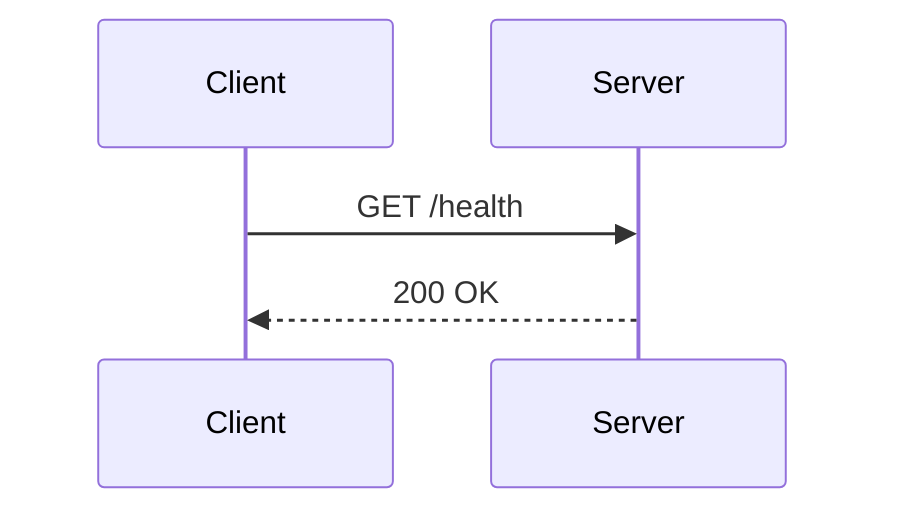

# Kroki / Backstage-style fences

Backstage TechDocs (and other Kroki-based renderers) mark mermaid diagrams with
a `kroki-mermaid` fence instead of plain `mermaid`. `mermaid-validate` treats
these as mermaid out of the box — no flags needed.

```kroki-mermaid
graph LR
    Dev[Developer] --> Docs[TechDocs]
    Docs --> Kroki[Kroki renderer]
    Kroki --> SVG[Rendered diagram]
```

Fences with extra attributes after the language token are also picked up:



If your platform uses a different prefix, pass it with `--fence`:

```bash
mermaid-validate --fence backstage-mermaid docs/
```
