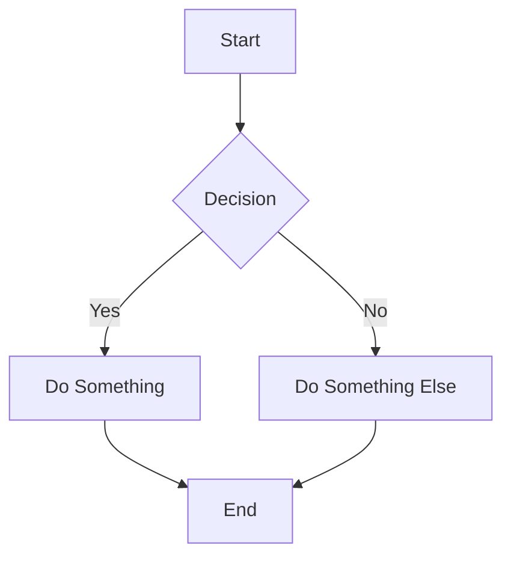
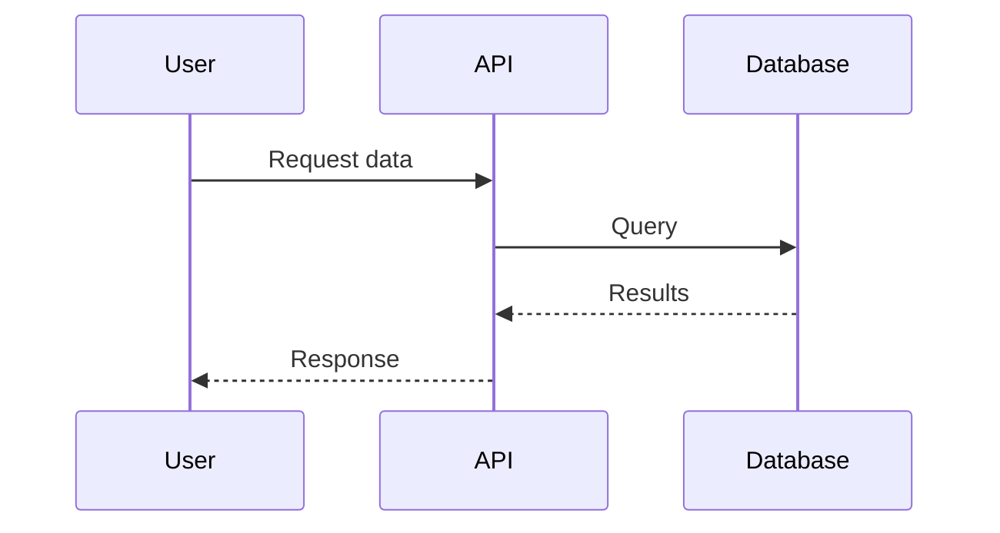

# Test Mermaid Diagram

This is a test file to validate the mermaid-validate skill.

## Simple Flowchart

```mermaid
graph TD
    A[Start] --> B{Decision}
    B -->|Yes| C[Do Something]
    B -->|No| D[Do Something Else]
    C --> E[End]
    D --> E
```

## Sequence Diagram

```mermaid
sequenceDiagram
    participant User
    participant API
    participant Database

    User->>API: Request data
    API->>Database: Query
    Database-->>API: Results
    API-->>User: Response
```
